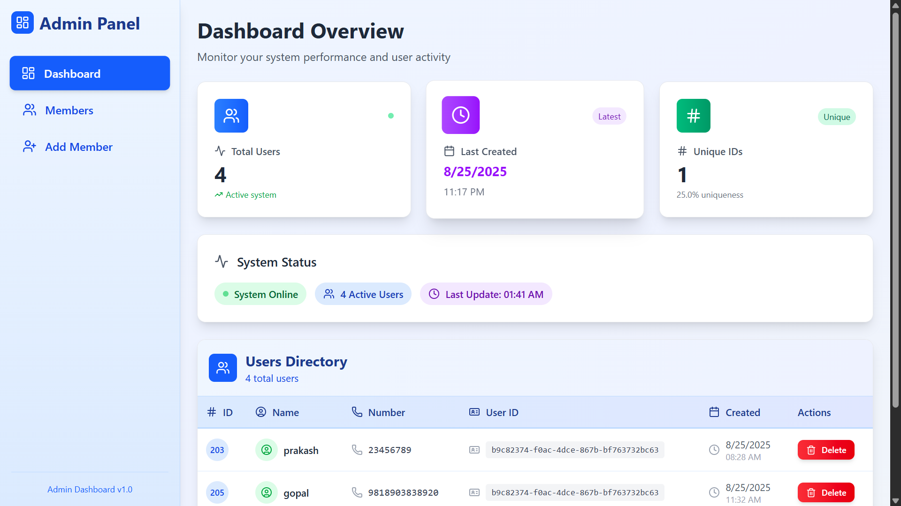
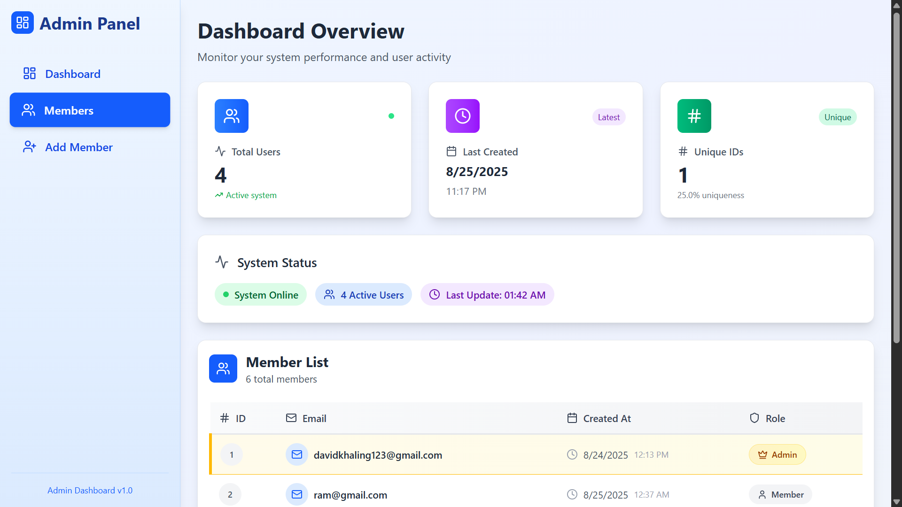
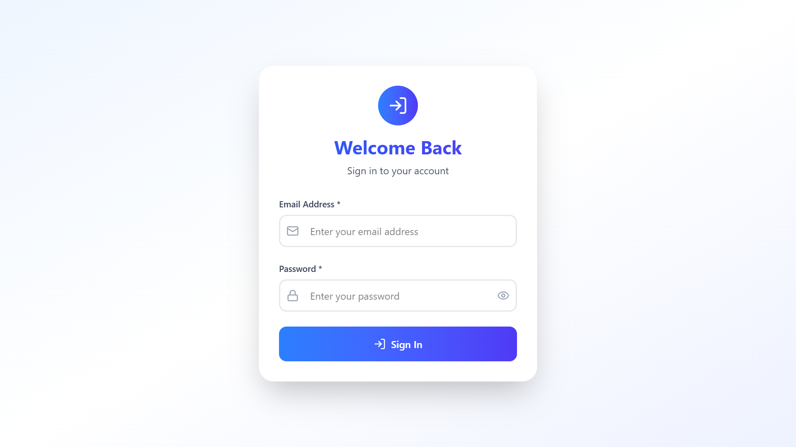

# NumHub

A modern React-based admin dashboard application with Supabase backend for managing members and user data. Built for personal use with comprehensive CRUD operations and member management capabilities.

## 🚀 Live Demo

- **🌐 Live Website**: [https://numhub.netlify.app](https://numhub.netlify.app)
- **📂 Repository**: [https://github.com/david-rai/numhub.git](https://github.com/david-rai/numhub.git)

## Design



## 📋 Overview

NumHub is a personal admin dashboard that allows you to:
- Manage members with full CRUD operations
- Add and manage user data including full names and contact numbers
- Secure authentication and authorization
- Real-time data updates with Supabase
- Responsive design for desktop and mobile use

## ✨ Features

### 👥 Member Management
- Add new members to the system
- View all members in a organized dashboard
- Edit member information
- Delete members with confirmation
- Search and filter members

### 📊 User Data Management
- Create user profiles with full name and contact information
- Read and display user data in tables/cards
- Update user information in real-time
- Delete user records with proper validation
- Bulk operations for multiple users

### 🔐 Admin Dashboard
- Secure login/logout functionality
- Role-based access control
- Dashboard analytics and overview
- Export data functionality
- Audit logs for user activities

## 🛠️ Tech Stack

- **Frontend**: React 18+ (Vanilla JavaScript - No TypeScript)
- **Backend**: Supabase (PostgreSQL + API)
- **Authentication**: Supabase Auth
- **Styling**: CSS3 / CSS Modules
- **State Management**: React useState & useEffect hooks
- **Deployment**: Netlify
- **Version Control**: Git + GitHub

# 📁 PROJECT STRUCTURE

```
numhub/
├── 📁 public/
│   ├── index.html
│   ├── favicon.ico
│   └── manifest.json
├── 📁 src/
│   ├── 📁 routes/
│   │   ├── 🏠 Home.js              # Main landing page
│   │   ├── 📊 Dashboard.js         # Admin dashboard main page
│   │   ├── 🔐 SignIn.js           # User authentication - Login
│   │   ├── ✍️  SignUp.js           # User registration
│   │   └── 📧 ContactForm.js       # Contact form for users
│   ├── 📁 config/
│   │   └── 🔧 supabase.js         # Supabase client configuration
│   ├── 📁 components/
│   │   ├── ➕ AddMembers.js       # Component to add new members
│   │   ├── 🏡 DashboardHome.js    # Dashboard homepage component
│   │   ├── ⏳ Loading.js          # Loading spinner/animation
│   │   ├── 👤 Member.js           # Individual member component
│   │   └── 📋 Sidebar.js          # Navigation sidebar
│   ├── 📁 styles/
│   │   ├── App.css
│   │   ├── index.css
│   │   └── components.css
│   ├── 📁 assets/
│   │   └── images/
│   ├── App.js                     # Main App component
│   └── index.js                   # React DOM entry point
├── 📄 .env.local                  # Environment variables
├── 📋 package.json               # Dependencies and scripts
├── 📖 README.md                  # This file
└── 🚀 netlify.toml               # Netlify deployment config
```

## 🎯 COMPONENT BREAKDOWN

### 📍 **Routes** (`/src/routes/`)
| Component | Purpose | Features |
|-----------|---------|----------|
| `Home.js` | Landing page for all visitors | Welcome screen, navigation to sign in/up |
| `Dashboard.js` | Main admin dashboard | Member overview, statistics, navigation |
| `SignIn.js` | User authentication | Login form, validation, redirect |
| `SignUp.js` | User registration | Registration form, email verification |
| `ContactForm.js` | User contact form | Contact submissions, form validation |

### ⚙️ **Configuration** (`/src/config/`)
| File | Purpose | Contains |
|------|---------|----------|
| `supabase.js` | Database connection | Supabase client, API configuration |

### 🧩 **Components** (`/src/components/`)
| Component | Purpose | Functionality |
|-----------|---------|---------------|
| `AddMembers.js` | Add new members | Form inputs, validation, CRUD operations |
| `DashboardHome.js` | Dashboard main view | Stats, recent activity, quick actions |
| `Loading.js` | Loading states | Spinner, progress indicators |
| `Member.js` | Individual member card | Display member info, edit/delete actions |
| `Sidebar.js` | Navigation menu | Routes, user info, logout functionality |

## 🚀 Getting Started

### Prerequisites

- Node.js (v16 or higher)
- npm or yarn
- Supabase account
- Git

### Installation

1. **Clone the repository**
   ```bash
   git clone https://github.com/david-rai/numhub.git
   cd numhub
   ```

2. **Install dependencies**
   ```bash
   npm install
   # or
   yarn install
   ```

3. **Set up environment variables**
   
   Create a `.env.local` file in the root directory:
   ```env
   REACT_APP_SUPABASE_URL=your_supabase_project_url
   REACT_APP_SUPABASE_ANON_KEY=your_supabase_anon_key
   ```

4. **Configure Supabase** (`src/config/supabase.js`)
   
   Your supabase.js file should look like:
   ```javascript
   import { createClient } from '@supabase/supabase-js'
   
   const supabaseUrl = process.env.REACT_APP_SUPABASE_URL
   const supabaseKey = process.env.REACT_APP_SUPABASE_ANON_KEY
   
   export const supabase = createClient(supabaseUrl, supabaseKey)
   ```

5. **Set up Supabase Database**
   
   Run these SQL commands in your Supabase SQL editor:
   
   ```sql
   -- Create members table
   CREATE TABLE members (
     id UUID DEFAULT gen_random_uuid() PRIMARY KEY,
     created_at TIMESTAMP WITH TIME ZONE DEFAULT NOW(),
     updated_at TIMESTAMP WITH TIME ZONE DEFAULT NOW(),
     full_name VARCHAR(255) NOT NULL,
     contact_number VARCHAR(20) NOT NULL,
     email VARCHAR(255) UNIQUE,
     status VARCHAR(20) DEFAULT 'active'
   );

   -- Create contact submissions table
   CREATE TABLE contact_submissions (
     id UUID DEFAULT gen_random_uuid() PRIMARY KEY,
     created_at TIMESTAMP WITH TIME ZONE DEFAULT NOW(),
     name VARCHAR(255) NOT NULL,
     email VARCHAR(255) NOT NULL,
     message TEXT NOT NULL,
     status VARCHAR(20) DEFAULT 'unread'
   );

   -- Enable Row Level Security
   ALTER TABLE members ENABLE ROW LEVEL SECURITY;
   ALTER TABLE contact_submissions ENABLE ROW LEVEL SECURITY;

   -- Create policies (adjust as needed for your auth setup)
   CREATE POLICY "Enable all operations for authenticated users" ON members
   FOR ALL USING (auth.role() = 'authenticated');

   CREATE POLICY "Enable read for authenticated users" ON contact_submissions
   FOR SELECT USING (auth.role() = 'authenticated');
   
   CREATE POLICY "Enable insert for all users" ON contact_submissions
   FOR INSERT WITH CHECK (true);
   ```

6. **Start the development server**
   ```bash
   npm start
   # or
   yarn start
   ```

   The application will open at [http://localhost:3000](http://localhost:3000)

## 🔧 Configuration

### Supabase Setup

1. Create a new Supabase project at [supabase.com](https://supabase.com)
2. Copy your project URL and anon key
3. Set up the database tables using the SQL commands above
4. Configure authentication providers if needed

### Environment Variables

| Variable | Description | Required |
|----------|-------------|----------|
| `REACT_APP_SUPABASE_URL` | Your Supabase project URL | ✅ |
| `REACT_APP_SUPABASE_ANON_KEY` | Your Supabase anonymous key | ✅ |

## 📖 Usage

### Admin Dashboard

1. **Login**: Access the admin dashboard with your credentials
2. **Member Management**: 
   - Navigate to Members section
   - Add new members using the "Add Member" button
   - Edit existing members by clicking the edit icon
   - Delete members with confirmation dialog

3. **User Data Management**:
   - Go to Users section
   - Create new user profiles with full name and contact
   - Update user information in real-time
   - Remove users when necessary

### API Operations

The app performs CRUD operations through Supabase config:

```javascript
// Import from your config
import { supabase } from '../config/supabase'

// Example member operations
// Create member
const { data, error } = await supabase
  .from('members')
  .insert({ full_name, contact_number })

// Read members
const { data, error } = await supabase
  .from('members')
  .select('*')
  .order('created_at', { ascending: false })

// Update member
const { data, error } = await supabase
  .from('members')
  .update({ full_name, contact_number })
  .eq('id', memberId)

// Delete member
const { data, error } = await supabase
  .from('members')
  .delete()
  .eq('id', memberId)
```

## 🌐 LIVE APPLICATION FEATURES

Visit [**numhub.netlify.app**](https://numhub.netlify.app) to see:

### 🏠 **Home Page**
- Welcome message and project introduction
- Navigation to Sign In/Sign Up
- Project overview and features

### 🔐 **Authentication System**
- **Sign In**: Secure login for admin access
- **Sign Up**: New user registration
- Protected routes and session management

### 📊 **Admin Dashboard**
- **Dashboard Home**: Overview statistics and recent activities
- **Member Management**: Full CRUD operations
- **Sidebar Navigation**: Easy access to all features

### 📧 **Contact Form**
- User inquiries and feedback collection
- Form validation and submission to database

## 🚀 Deployment

### Netlify Deployment

The application is live at [**numhub.netlify.app**](https://numhub.netlify.app)

For updates:

1. **Push changes to the main branch:**
   ```bash
   git add .
   git commit -m "Your commit message"
   git push origin main
   ```

2. **Netlify Auto-Deploy**: Automatically builds and deploys from GitHub

### Manual Deployment to Netlify

1. **Build the project:**
   ```bash
   npm run build
   ```

2. **Deploy to Netlify:**
   - Drag and drop the `build` folder to Netlify
   - Or connect your GitHub repository for auto-deployment

3. **Environment Variables on Netlify:**
   - Go to Site Settings → Environment Variables
   - Add your Supabase URL and API key

## 🛡️ Security

- All database operations use Row Level Security (RLS)
- Authentication handled by Supabase Auth
- API keys stored in environment variables
- HTTPS enforced in production
- Input validation and sanitization

## 📊 Database Schema

### Members Table
```sql
members (
  id: UUID (Primary Key)
  created_at: TIMESTAMP
  updated_at: TIMESTAMP
  full_name: VARCHAR(255)  -- Full name of the member
  contact_number: VARCHAR(20)  -- Contact number
  email: VARCHAR(255) UNIQUE
  status: VARCHAR(20) DEFAULT 'active'
)
```

### Contact Form Submissions
```sql
contact_submissions (
  id: UUID (Primary Key)
  created_at: TIMESTAMP
  name: VARCHAR(255)
  email: VARCHAR(255)
  message: TEXT
  status: VARCHAR(20) DEFAULT 'unread'
)
```

## 🔧 Development

### Available Scripts

- `npm start` - Start development server
- `npm run build` - Build for production
- `npm test` - Run tests
- `npm run eject` - Eject from Create React App

### Code Style

- Use ESLint and Prettier for code formatting
- Follow React best practices
- Use functional components with hooks
- Implement proper error handling

## 🤝 Contributing

Since this is for personal use, contributions are not expected. However, if you find bugs or have suggestions:

1. Create an issue in the repository
2. Fork the project
3. Create a feature branch
4. Commit your changes
5. Push to the branch
6. Open a Pull Request

## 📝 License

This project is for personal use. All rights reserved.

## 📞 Contact

**David Rai**
- GitHub: [@david-rai](https://github.com/david-rai)
- Email: [Your email if you want to include it]

## 🚨 Troubleshooting

### Common Issues

1. **Supabase Connection Issues**
   - Verify your environment variables
   - Check Supabase project status
   - Ensure RLS policies are correctly configured

2. **Build Errors**
   - Clear node_modules and reinstall
   - Check for outdated dependencies
   - Verify React version compatibility

3. **Authentication Problems**
   - Check Supabase Auth configuration
   - Verify redirect URLs
   - Ensure proper policy setup

### Logs and Debugging

- Check browser console for client-side errors
- Use Supabase dashboard for database logs
- Enable React Developer Tools for debugging

## 🔄 Updates and Maintenance

- Regularly update dependencies
- Monitor Supabase usage and limits
- Backup database regularly
- Review and update security policies

---

**Last Updated**: September 2025
**Version**: 1.0.0